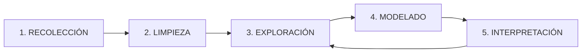

# Módulo 2 — Proceso de Análisis de Datos

> [!info] Objetivo
> Dominar las 5 fases del proceso analítico aplicadas a datos de señales AIS del Canal de Panamá.

## 🔄 El Ciclo Analítico

---

## 👨‍🏫 Guía del Profesor (Ejemplo en Clase)
*Usa esta guía para explicar el cuaderno `M2_Limpieza_AIS.ipynb`*

1. **Celda 1: Diagnóstico**: Mostramos `df.isnull().sum()`. Explica que en el sector marítimo, los nulos suelen ser "puntos ciegos" o interferencias en el sensor AIS.
2. **Celda 2: Geofencing**: Usamos `.between()` para crear una "caja virtual" del Canal de Panamá. Mostramos cómo se eliminan puntos que "caen" en el desierto o el Ártico por errores de GPS.
3. **Celda 3: Imputación**: Reemplazamos velocidades nulas con la **mediana**. Explica por qué usamos la mediana y no la media (la media se ve afectada por barcos a velocidad 0 o muy alta).
4. **Celda 4: Visualización**: Comparamos el "Antes" vs "Después" con un gráfico de densidad.

---

## 🚀 Laboratorio Práctico 2
**Reto**: Limpia el dataset `ais_muestra_canal.csv` eliminando los buques que se encuentren fuera de las coordenadas del Canal.

---

## 📥 Recursos y Descargas
- [📊 Descargar Dataset: ais_muestra_canal.csv](02_Datasets/ais_muestra_canal.csv)
- [📓 Cuaderno en Formato Local: M2_Limpieza_AIS.ipynb](03_Notebooks/M2_Limpieza_AIS.ipynb)

---
[M1 Analisis_vs_Reportes|⬅️ Anterior] | [Inicio|🏠 Inicio] | [M3 Tipos_Analisis|Siguiente ➡️]
